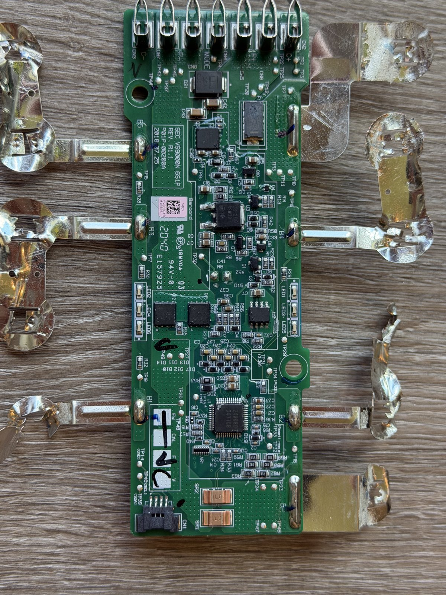

# Samsung VCA-SBT90 battery — BMS reverse engineering & PF clear

Right-to-repair project on a Samsung **VCA-SBT90** vacuum battery (Jet 90 / Jet 75, 6S1P, 21.6 V).
The pack's BMS had latched a **permanent failure (PF)** and blown its chemical fuse, so it would never
charge or discharge again, even with new cells. This repo holds the tooling and notes used to get into
the BMS over SMBus, dump its flash, and clear the PF so the board can be reused with fresh cells.

*Board: SEC VS9000N 6S1P, Rev R1.1, P01P-00200A (2018-07-25). U1 = Renesas RAJ240080 (RL78 MCU + analog front end).*

## Status

- PF cleared (2026-10-07). BatteryStatus `0x48C0` → `0x00C0` (TERMINATE CHARGE/DISCHARGE gone),
  charge request 0 → 150 mA / 25.6 V, fuse-drive FET Q10 gate 3.3 V → 0 V. Calibration and config intact
  (FCC 2390 mAh, 387 cycles, model `SEC_VS9000NL`).
- Next: replace F1 (Dexerials SCP 45 A), fit 6 matched cells (Samsung INR18650-30Q).

## How it works (short version)

1. **Access:** a Raspberry Pi Pico (MicroPython) on the board's SMBus connector CN1 (SDA TP39, SCL TP40,
   GND TP14), address `0x0B`. Holding **TOOL0 (TP32) low across a reset (TP33)** starts a flash bootloader
   instead of the battery firmware.
2. **Read:** bootloader cmd `0xFC` — write `[FC a0 a1 a2 n0 n1]` with no STOP, then read `n` bytes.
3. **Write data flash:** bootloader cmd `0xFB` — `[FB][3+n][a0 a1 a2][n bytes][PEC]`, programmed at STOP
   via the Renesas PFDL; result readable with cmd `0x70`. `0x24` = blank check, `0x21` = 1 KB block erase.
4. **Data flash** is an append-only EEPROM emulation: two rotating 2 KB blocks of 6-byte records
   `[idx][~idx][u32 LE]`, newest record per index wins, 158 params (0x00–0x9D).
5. **The PF:** the firmware keeps a 64-bit fault mask in RAM; bits 48–62 are permanent faults and are
   persisted in **param 0x17**. This unit had `P0x17 = 4` (fault bit 50). Appending the record
   `17 E8 00 00 00 00` to the active block cleared it (`pico/pf_append.py`). Undo = append `17 E8 04 00 00 00`.

Full details: [docs/SESSION_NOTES.md](docs/SESSION_NOTES.md) (hardware map, wiring, dead ends) and
[docs/WRITE_PLAN.md](docs/WRITE_PLAN.md) (bootloader protocol decode, write proof, PF identification).

## Layout

| Path | Contents |
|---|---|
| `pico/` | MicroPython tools: `smb.py` (SMBus/PEC), `bl.py` + `dfw.py` (bootloader read/write, verified snapshots, intact check), `sbs_probe.py`, `bl_dump.py`/`run_dump.py`, `pf_append.py`, `pf_verify.py` |
| `pico/experiments/` | Probes and one-off experiments from the investigation (boot-ROM, fuzzing, write framing tests) |
| `firmware/` | `codeflash.bin` (64 KB), `dataflash.bin` (4 KB), `code.dis` (RL78 disassembly), `df_pre_pfclear.hex` (data flash right before the fix) |
| `backups/` | Verified dumps with SHA256SUMS, SBS register backups |
| `dumps/` | Raw dump/probe outputs |
| `logs/` | Session logs from each run |
| `docs/` | Notes and the write/PF write-up |
| `images/` | Photos |

Run a tool with `mpremote connect /dev/cu.usbmodem1101 cp pico/dfw.py pico/smb.py : + run pico/pf_verify.py`.

## Safety

Work on a bench supply through a resistor ladder (6 × 100 Ω, 22.2 V, 100 mA limit) with no real cells
fitted, and keep a backup of the data flash before any write. This is a 6S lithium pack; the PF exists
for a reason. The failure field read "over voltage" here; the old cells are being replaced, but check
cell voltages and balance on the first charges before trusting the pack.

Firmware images are Samsung SDI's; keep this repo private.
