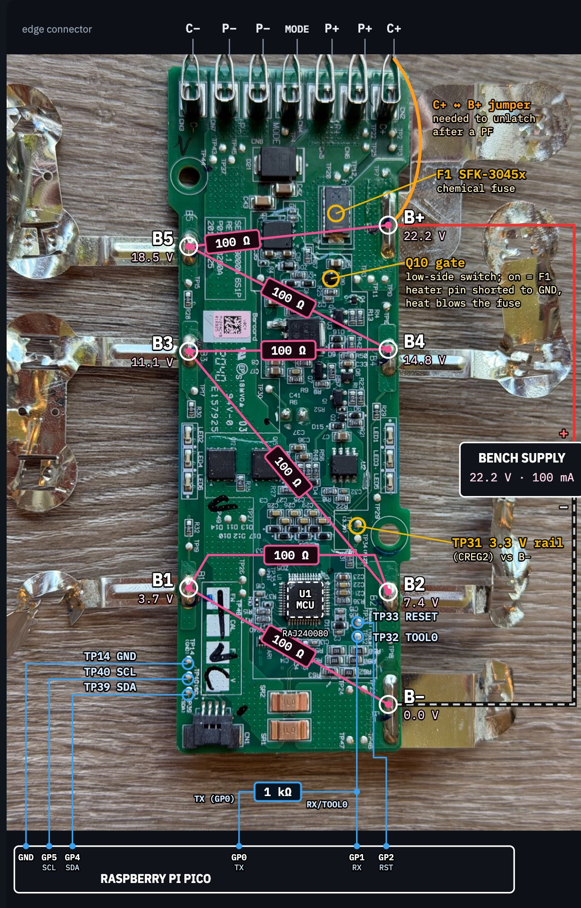

# Samsung VCA-SBT90 battery — BMS reverse engineering & PF clear

Right-to-repair project on a Samsung **VCA-SBT90** vacuum battery (Jet 90 / Jet 75, 6S1P, 21.6 V).
The pack's BMS had latched a **permanent failure (PF)** and blown its chemical fuse, so it would never
charge or discharge again, even with new cells. This repo holds the tooling and notes used to get into
the BMS over SMBus, dump its flash, and clear the PF so the board can be reused with fresh cells.


*Board: SEC VS9000N 6S1P, Rev R1.1, P01P-00200A (2018-07-25). U1 = Renesas RAJ240080 (RL78 MCU + analog front end).*



*Bench wiring: six 100 Ω resistors between B−…B+ stand in for the cells (22.2 V, 100 mA limit). Pico GP4/GP5/GP2/GP1/GND go to TP39/TP40/TP33/TP32/TP14; TX (GP0) reaches TOOL0 through a 1 kΩ resistor. Q10 is the low-side switch that fires F1 (SFK-3045x); C+ is jumpered to B+ to unlatch after a PF.*

## Status

- PF cleared (2026-10-07). BatteryStatus `0x48C0` → `0x00C0` (TERMINATE CHARGE/DISCHARGE gone),
  charge request 0 → 150 mA / 25.6 V, fuse-drive FET Q10 gate 3.3 V → 0 V. Calibration and config intact
  (FCC 2390 mAh, 387 cycles, model `SEC_VS9000NL`).
- Fuse drive disarmed for assembly (ManufactureDate = 0, 2026-10-08). Next: F1 (Dexerials SCP 45 A) and 6 matched
  Samsung INR21700-30T, per the cell install procedure below.

## How it works (short version)

1. **Access:** a Raspberry Pi Pico (MicroPython) on the board's SMBus connector CN1 (SDA TP39, SCL TP40,
   GND TP14), address `0x0B`. Holding **TOOL0 (TP32) low across a reset (TP33)** starts a flash bootloader
   instead of the battery firmware.
2. **Read:** bootloader cmd `0xFC` — write `[FC a0 a1 a2 n0 n1]` with no STOP, then read `n` bytes.
3. **Write data flash:** bootloader cmd `0xFB` — `[FB][3+n][a0 a1 a2][n bytes][PEC]`, programmed at STOP
   via the Renesas PFDL; result readable with cmd `0x70`. `0x24` = blank check, `0x21` = 1 KB block erase.
4. **Data flash** is an append-only EEPROM emulation: two rotating 2 KB blocks of 6-byte records
   `[idx][~idx][u32 LE]`, newest record per index wins, 158 params (0x00–0x9D).
5. **The PF:** the firmware keeps a 64-bit fault mask in RAM; bits 48–62 are permanent faults and are
   persisted in **param 0x17**. This unit had `P0x17 = 4`: fault bit 50 = code 0xCA, the dead-cell check
   (a cell under 1000 mV after wake). The fault log snapshot shows cell 3 at 0 V when it tripped, ~440
   powered hours before the bench work. Appending the record
   `17 E8 00 00 00 00` to the active block cleared it (`pico/pf_append.py`). Undo = append `17 E8 04 00 00 00`.

Docs:

| Doc | Contents |
|---|---|
| [docs/hardware.md](docs/hardware.md) | Board, pads, fuse drive, bench ladder and wake, Pico wiring, dead ends |
| [docs/protocol.md](docs/protocol.md) | SMBus bootloader commands, data-flash EEL format, PF clear, SBS command table, 0x7A unlock and gated commands |
| [docs/re/protection.md](docs/re/protection.md) | Every protection check: code -> bit -> condition -> threshold -> release |
| [docs/re/param-names.md](docs/re/param-names.md) | Names/units for all 158 params (P00-P9D), SBS mappings |
| [docs/re/afe-map.md](docs/re/afe-map.md) | AFE register map as used by the firmware (CC, OC/SC detectors, wake current, fuse on P1.1) |
| [docs/re/gauge-scaling.md](docs/re/gauge-scaling.md) | Current unit (10 mA), coulomb counter, FCC learning (capped 2850 mAh), gauge reseed |
| [docs/re/events-boot.md](docs/re/events-boot.md) | Event-log codes, 0x80 test modes, 0xA7/0xB4, log freeze/unfreeze |
| [docs/re/balancing.md](docs/re/balancing.md) | Evidence that the firmware does no cell balancing |
| [docs/re/_board_log.md](docs/re/_board_log.md) | Log of every board action taken during the RE |

## Layout

| Path | Contents |
|---|---|
| `bms.py` | Host CLI wrapping the Pico tools (status / params / backup / set-param) |
| `pico/` | MicroPython tools: `smb.py` (SMBus/PEC), `bl.py` + `dfw.py` (bootloader read/write, verified snapshots, intact check), `sbs_probe.py`, `bl_dump.py`/`run_dump.py`, `pf_append.py`, `pf_verify.py` |
| `pico/experiments/` | Probes and one-off experiments from the investigation (boot-ROM, fuzzing, write framing tests) |
| `firmware/` | `codeflash.bin` (64 KB), `dataflash.bin` (4 KB), `code.dis` (RL78 disassembly), `df_pre_pfclear.hex` (data flash right before the fix) |
| `backups/` | Verified dumps with SHA256SUMS, SBS register backups |
| `dumps/` | Raw dump/probe outputs |
| `logs/` | Session logs from each run |
| `docs/` | Hardware and protocol reference; `docs/re/` firmware RE |
| `images/` | Photos |

## Usage

Host CLI (needs `mpremote`; the Pico on `/dev/cu.usbmodem1101`, override with `BMS_PORT`; pack awake with supply on C+):

```
uv run bms.py status                 # decoded SBS: pack/cell volts, capacity, status flags, PF verdict
uv run bms.py params [--json]        # every data-flash param (newest record per index), via the bootloader
uv run bms.py backup [FILE]          # save the 4 KB data-flash image (default backups/df_<time>.bin)
uv run bms.py set-param IDX VALUE    # append one record (asks first, saves a pre-write image, verifies the diff)
uv run bms.py log [--json]           # decoded fault/event log with cell snapshots
uv run bms.py status --json          # same readout as JSON
uv run bms.py report                 # status + log + named params + raw image -> reports/<time>.json + .md
```

Lower-level scripts run directly: `mpremote connect /dev/cu.usbmodem1101 cp pico/dfw.py pico/smb.py : + run pico/pf_verify.py`.

## Safety

Work on a bench supply through a resistor ladder (6 × 100 Ω, 22.2 V, 100 mA limit) with no real cells
fitted, and keep a backup of the data flash before any write. This is a 6S lithium pack; the PF exists
for a reason. Here it was a dead original cell.

### Cell install procedure

F1 has to go on before the cells (no hot air near the cells), so the firmware's fuse drive is disarmed
during assembly. The fuse pin (P1.1) is armed only while a PF bit is set **and** ManufactureDate (P10 high
half) is non-zero (0x8769-0x8783, [afe-map.md](docs/re/afe-map.md)). With the date at 0 a PF still latches
and the FETs still open; the fuse just isn't fired.

1. **Done 2026-10-08:** `set-param 0x10 0x00004C50` (ManufactureDate 0x5239 -> 0; SBS 0x1B reads 1980-00-00).
2. Cells: 6× Samsung INR21700-30T (the config header at 0xD410 names `21700_30T`), one batch, matched to
   within ~20 mV, none above 4.2 V. Links carry the full pack current (logged peak −32 A, firmware limit
   −40 A / 3 s): use 0.2 × 10 mm pure nickel doubled or Ni-Cu composite, not 6 mm strip, not nickel-plated steel.
3. Fit F1, then connect the board: B- first, B1..B5 in order, B+ last. Keep the CN1 (and, for `set-param`,
   TOOL0/RESET) wires reachable.
4. `bms.py status`: six sane cells, spread < ~20 mV, PF clear. If 0xCA tripped while connecting,
   `set-param 0x17 0` and re-check; the fuse can't fire meanwhile.
5. **Only with PF clear:** restore the date, `set-param 0x10 0x52394C50`. The fuse arms the moment the date
   is non-zero, so restoring it with a PF bit set blows F1.
6. Unfreeze fault/event logging (frozen since the 0xCA trip, re-checked every boot): `set-param 0x87 0x00168F54`
   (snapshot code 0xCA -> 0, history kept; [events-boot.md](docs/re/events-boot.md)). Takes effect at next wake.
7. Optional, reseed the gauge for the new cells: unlock, write P32 `0x530CBEEF` -> `0x530C0000` (clears the
   0xBEEF marker), re-lock, reset. FCC/Qmax/R tables/cycle count reseed from ROM, lifetime data kept
   ([gauge-scaling.md](docs/re/gauge-scaling.md)). Reported FCC is capped at 2850 mAh either way.

After that: the firmware does **not balance cells** ([balancing.md](docs/re/balancing.md)) and latches a PF on
imbalance (0xCC: spread > 195 mV while charging above 3.7 V, or > 170/200 mV at rest, for 20 s) and on any
cell > 4300 mV for 5 s (0xC8). Check the spread with `bms.py status` after each of the first charges.
P17's high word is a protection-disable mask restored at every boot; it must read 0 (`bms.py params`).
Not covered by the disarm: a second-level hardware protector, if fitted, can still blow F1 on cell over-voltage.

Firmware images are Samsung SDI's; keep this repo private.
